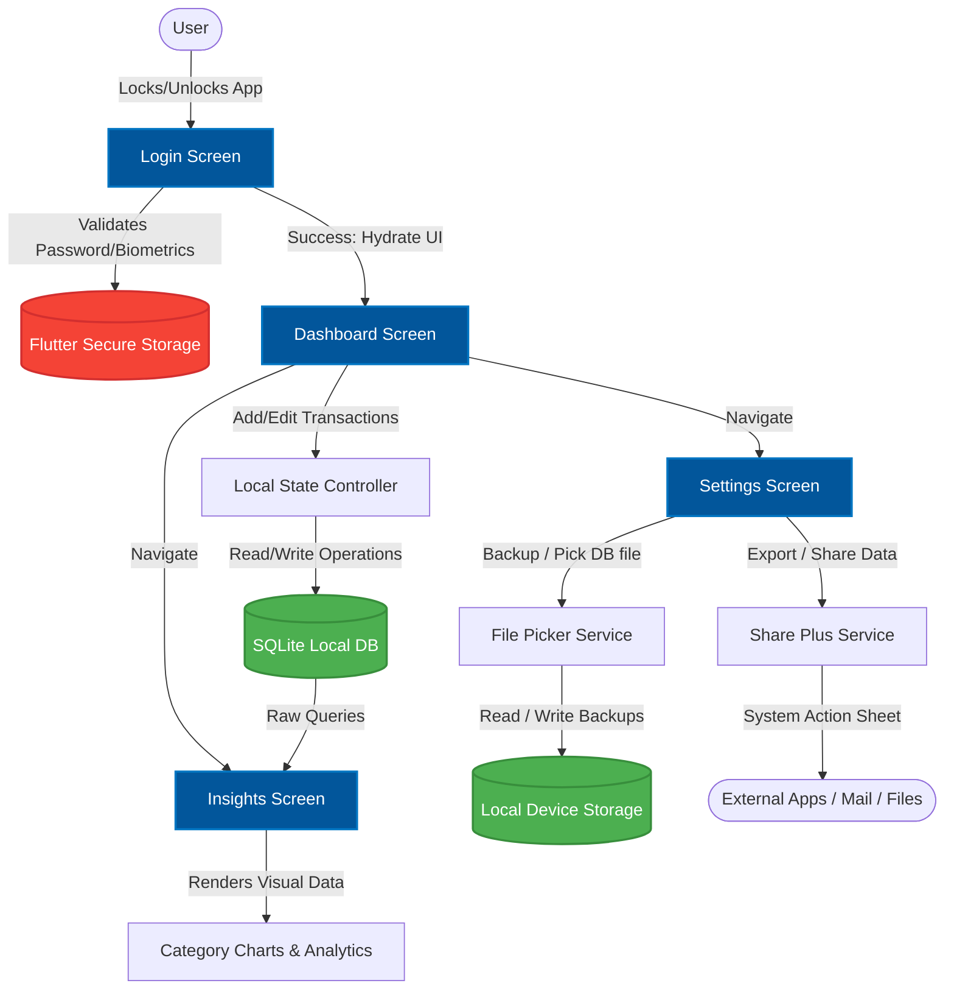

# 💳 Finport

[](https://flutter.dev)
[](https://dart.dev)
[](https://flutter.dev)
[](LICENSE)
[](https://pub.dev/packages/flutter_secure_storage)

> **Finport** (Financial Portfolio & Portal) is a premium, offline-first personal finance tracker and portfolio manager designed for privacy, simplicity, and visual elegance. Crafted meticulously with Flutter, Finport puts control back in your hands by storing 100% of your financial data securely on your local device.

---

## 📖 Table of Contents
- [✨ Key Features](#-key-features)
- [📐 System Flow & Architecture](#-system-flow--architecture)
- [🛠 Tech Stack & Core Libraries](#-tech-stack--core-libraries)
- [📁 Project Directory Structure](#-project-directory-structure)
- [🚀 Getting Started](#-getting-started)
- [💾 Data Security & Backups](#-data-security--backups)
- [🎨 Design Language](#-design-language)
- [🤝 Contributing](#-contributing)
- [📄 License](#-license)

---

## ✨ Key Features

### 🏠 Modern, Interactive Dashboard (`dashboard_screen.dart`)
*   **Net Worth Breakdown:** Consolidated overview of assets, cash, bank balances, and liabilities.
*   **Quick Actions:** Log income or expenses in under 3 seconds with smart tags.
*   **Recent Activity:** Filterable and searchable feed of transactions.

### 📊 Rich Analytical Insights (`insights_screen.dart`)
*   **Spending Breakdown:** Beautiful pie and bar charts showing where your money goes.
*   **Trend Reports:** Track your savings rate and historical category performance.
*   **Custom Milestones:** Visualize budgets versus actual expenditures.

### 🔒 Device-Level Security & Privacy (`login_screen.dart`)
*   **Secure Authentication:** Secure local login mechanism.
*   **Encrypted Storage:** Passcodes, settings, and credentials stored safely using platform Keychain/Keystore via `flutter_secure_storage`.
*   **100% Offline:** No cloud connections, tracking SDKs, or external databases. Your data never leaves your phone.

### 💾 Complete Data Portability (`settings_screen.dart`)
*   **Encrypted JSON Backups:** Export full transaction logs locally using `file_picker`.
*   **Seamless Sharing:** Share PDF/CSV summaries and database backups using standard system shares via `share_plus`.
*   **Auto-Restore:** Direct imports of legacy records on new devices.

---

## 📐 System Flow & Architecture

Finport utilizes a robust local Model-View-Controller/Repository architecture to process financial operations seamlessly and offline. Below is the technical system and information flow of the application:



---

## 🛠 Tech Stack & Core Libraries

Finport is built using Dart and the Flutter SDK, alongside these high-quality plugins:

| Package | Purpose | Category |
| :--- | :--- | :--- |
| **`sqflite`** | High-performance SQL database engine for robust local relational storage. | Database |
| **`flutter_secure_storage`** | Secure storage of sensitive data (encryption keys, session state) using Keychain (iOS) & Keystore (Android). | Security |
| **`share_plus`** | Native share sheets to export reports, CSV sheets, and raw backup records. | Integration |
| **`file_picker`** | Platform-native file picker to select custom backup templates. | File System |
| **`google_fonts`** | Dynamic loading of custom premium typography (e.g., Outfit/Inter). | Design & UI |
| **`intl`** | Provides localized formatting for currencies, dates, and numbers. | Internationalization |
| **`path_provider`** | Finds the correct directories on Android, iOS, and macOS to store local assets. | File System |

---

## 📁 Project Directory Structure

```text
lib/
├── main.dart                 # Application entry point, initializing database & secure configurations
├── database/
│   └── database_helper.dart  # Handles SQL schema, migrations, and transactional queries
├── models/
│   ├── transaction.dart      # Data model mapping to SQLite transactions table
│   ├── account.dart          # Data model for different wallets / bank accounts
│   └── category.dart         # Categories (e.g., Food, Travel, Investments)
├── screens/
│   ├── login_screen.dart     # Secure authentication screen using encrypted credentials
│   ├── dashboard_screen.dart # Interactive asset balance summaries & recent activity list
│   ├── insights_screen.dart  # Statistical charts, category-wise breakdowns, and trend trackers
│   └── settings_screen.dart  # Controls themes, backups, export triggers, and configuration overrides
└── widgets/
    ├── transaction_card.dart # Reusable list card item with custom status and colors
    ├── summary_card.dart     # Dynamic cards displaying Net Worth, Total Income/Expense
    └── custom_charts.dart    # Custom painted charts for budget indicators
```

---

## 🚀 Getting Started

Follow these instructions to set up the project locally on your development machine.

### Prerequisites
*   **Flutter SDK:** `^3.9.2` or later
*   **Dart SDK:** `^3.0.0` or later
*   **IDE:** Android Studio, VS Code, or Xcode (for iOS builds)
*   **Cocoapods:** Required for iOS/macOS platform builds

### Installation & Run

1.  **Clone the Repository:**
    ```bash
    git clone https://github.com/yourusername/finport.git
    cd finport
    ```

2.  **Install Dependencies:**
    ```bash
    flutter pub get
    ```

3.  **Run Code Verification & Linting:**
    ```bash
    flutter analyze
    ```

4.  **Run the Application:**
    ```bash
    # Run in Debug Mode on your connected emulator or device
    flutter run
    ```

5.  **Build Production Bundles:**
    ```bash
    # Android App Bundle (Google Play Store)
    flutter build appbundle

    # iOS IPA (Apple App Store)
    flutter build ipa
    ```

---

## 💾 Data Security & Backups

Because **Finport** is fully offline-first:
*   Your local database is saved in your application’s sandbox directory (under `path_provider`'s `getApplicationDocumentsDirectory`).
*   **We strongly recommend using the Backup feature** in the Settings screen to export an encrypted JSON copy of your database. Keep it in a secure cloud folder (like iCloud, Google Drive) or external drive in case you lose your device.
*   Security configurations utilize AES encryption for values stored on device disks.

---

## 🎨 Design Language

*   **Color Palette:** Harmony-tailored, premium dark interfaces featuring subtle glassmorphic elements. Includes clean, vibrant accent highlights (Emerald for incomes, Crimson for expenses, Deep Blue for investments).
*   **Typography:** Outfit & Inter fonts via `google_fonts` offering excellent numeric readability for balance figures.
*   **Layout:** Highly responsive grids adapting perfectly to iPhones, Android flagships, tablets, and desktop windows.

---

## 🤝 Contributing

Contributions make the open-source community amazing! 

1.  Fork the Project
2.  Create your Feature Branch (`git checkout -b feature/AmazingFeature`)
3.  Commit your Changes (`git commit -m 'Add some AmazingFeature'`)
4.  Push to the Branch (`git push origin feature/AmazingFeature`)
5.  Open a Pull Request

---

## 📄 License

Distributed under the MIT License. See `LICENSE` for more information.

---

*Developed with ❤️ by Rajesh Choudhury.*
